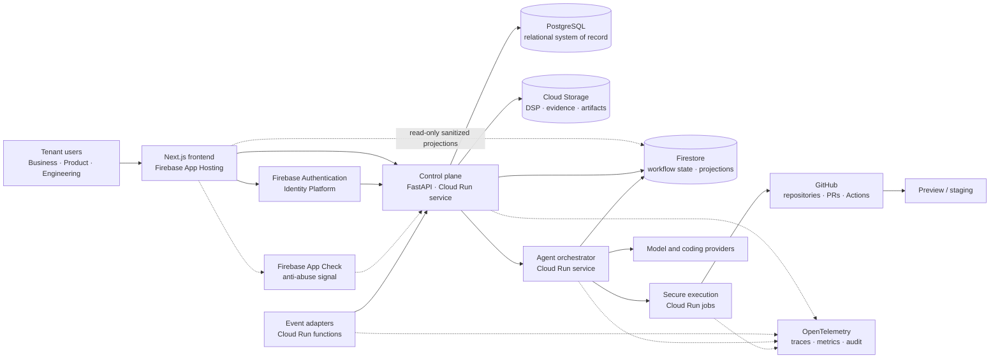

# System context

Solid lines represent product or identity flows. Dashed lines represent supplemental
signals, constrained projections, or operational evidence.

The frontend never authorizes a protected operation. The control plane verifies Firebase
ID tokens, resolves application membership, and enforces policy. App Check reduces abuse
but is not identity. Firestore client writes are denied; trusted services write state
using per-service IAM because server libraries bypass Security Rules.

## Persistence authority

| Concern                                           | Authority                       |
| ------------------------------------------------- | ------------------------------- |
| Tenants, users, memberships, roles                | PostgreSQL                      |
| Approvals, audit, billing, release records        | PostgreSQL                      |
| Orchestration state, checkpoints, progress        | Firestore                       |
| Sanitized real-time UI projections                | Firestore                       |
| DSP documents, logs, evidence, build artifacts    | Cloud Storage                   |
| User credentials and identity-provider federation | Firebase Auth/Identity Platform |

There is no distributed transaction across PostgreSQL and Firestore. Cross-store
consumers follow the transactional outbox/inbox, aggregate-version, bounded retry,
dead-letter, and reconciliation protocol in
[ADR-0008](../adrs/0008-reliable-cross-store-events.md). Data classification, projection
allowlists, retention, and deletion are defined in
[data governance](data-governance.md).
